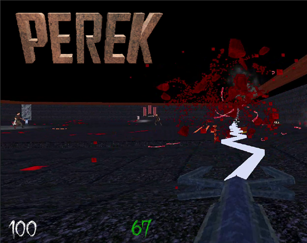

<!-- ## Languages

   -->

# Hi, I'm Nahian Shabab
## My Projects:
**Perek: (First Person Shooter)**   

 
    
**Imposter Hydraulics (3D Puzzle Game)**  
 
    
 **Sentinel (Home Automation System)**  
    
**TechShop (Online Electronics Shop)**  
   

## I'm Interested in:
- Machine Learning
- Full Stack Software Development
- Game Development

## My Skills:

### Machine Learning

### Programming Languages:
      

### Frameworks:

 

 

### Database:

### Version Control:
 

### IDE/Code Editors:
 

### API Testing:

### UI/UX:

### Micro-controller:

### Game Engine:

### Documenting:

### 3D Modelling:

