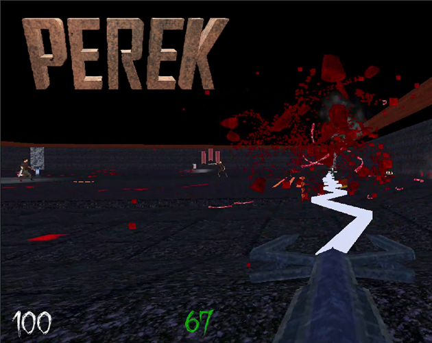
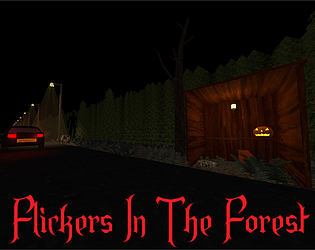

# Hi, I'm Nahian Shabab
#### Education:  B.Sc. in Computer Science & Engineering
#### Software Engineer | Game Developer | Researcher
## My Projects:
**Perek: (First Person Shooter)**  

 
    
  **Flickers In The Forest: (Horror Walking Sim)**  

 
 
**Imposter Hydraulics (3D Puzzle Game)**  
 
    
 **Sentinel (Home Automation System)**   
**TechShop (Online Electronics Shop)**  

## I'm Interested in:
- Full Stack Web Development
- Game Development
- Computer Vision ( Object Detection, 3D Structure Reconstruction)

## My Skills:

### Web Development Frameworks:

### Machine Learning

### Programming Languages:
     

### Database:

### API Testing:

### Embedded Systems:

### Game Engine:

### 3D Modelling:

